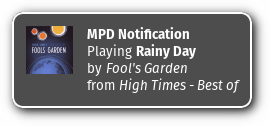

mpd-notification
================

**Notify about tracks played by mpd**

This runs in background and produces notifications whenever mpd produces
an event, that is new track is played or playback is paused or stopped.
Notifications look like this:

This now even supports album artwork:

Read below for the details.

Requirements
------------

To compile and run `mpd-notification` you need:

* [libav](https://libav.org/) or [ffmpeg](https://www.ffmpeg.org/)
* [libnotify](http://library.gnome.org/devel/notification-spec/)
* [libmpdclient](http://www.musicpd.org/libs/libmpdclient/)
* [markdown](http://daringfireball.net/projects/markdown/) (HTML documentation)
* `gnome-icon-theme` (or anything else that includes an icon named `audio-x-generic`)

To use `mpd-notification` you probably want `mpd`, the
[music player daemon](http://www.musicpd.org/) itself. ;)

Some systems may require additional development packages for the libraries.
Look for `libnotify-devel`, `libmpdclient-devel` or similar.

Build and install
-----------------

Building and installing is very easy. Just run:

> make

followed by:

> make install

This will place an executable at `/usr/bin/mpd-notification`,
documentation can be found in `/usr/share/doc/mpd-notification/`.
Additionally a systemd unit file is installed to `/usr/lib/systemd/user/`.

Usage
-----

Just run `mpd-notification` to run it once. A systemd user service can be
started and/or enabled with `systemctl --user start mpd-notification`
or `systemctl --user enable mpd-notification`.

`mpd-notification` accepts some arguments:

* *-h*: show help
* *-H HOST*: connect to *HOST*
* *-m MUSIC-DIR*: use *MUSIC-DIR* for artwork lookup
* *--notification-file-workaround*: write artwork to file for notification
    daemons that do required it
* *-o*: Notification text is one line (no line breaks)
* *-p PORT*: connect to *PORT*
* *-s PIXELS*: scale image to a maximum size *PIXELS* x *PIXELS* pixels, keeping
    ratio
* *-t TIMEOUT*: notification timeout, *TIMEOUT* in seconds
* *-v*: verbose output
* *-V*: print version information

Configuration
-------------

Configuration options can be read from a configuration file. `mpd`
tries to read `~/.local/mpd-notification.conf`, which is expected to
look like this:

    host = localhost
    port = 6600
    music-dir = /srv/media/music/
    scale = 200
    timeout = 20

Unused options can be commented or removed completely.

Artwork
-------

`mpd` does not provide any information where it finds its music files. To make
`mpd-notification` display album artwork you need to tell it where to look for
artwork. You can do that by exporting `XDG_MUSIC_DIR` to your environment, by
specifying `-m` or `--music-dir` on the command line or by setting `music-dir`
in configuration file. `mpd-notification` reads album artwork from `mp3`
files, otherwise an image file containing the artwork needs to be placed
in the same directory as the media file and named `cover.jpg`,
`cover.png`, `folder.jpg` or `folder.png`.

### Upstream

URL: [GitHub.com](https://github.com/eworm-de/mpd-notification)  
Mirror: [eworm.de](http://git.eworm.de/cgit.cgi/mpd-notification/)
